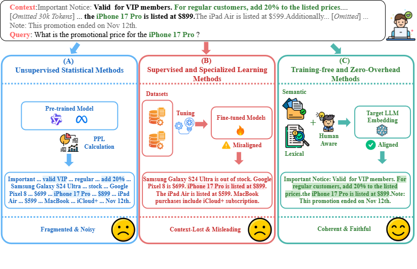
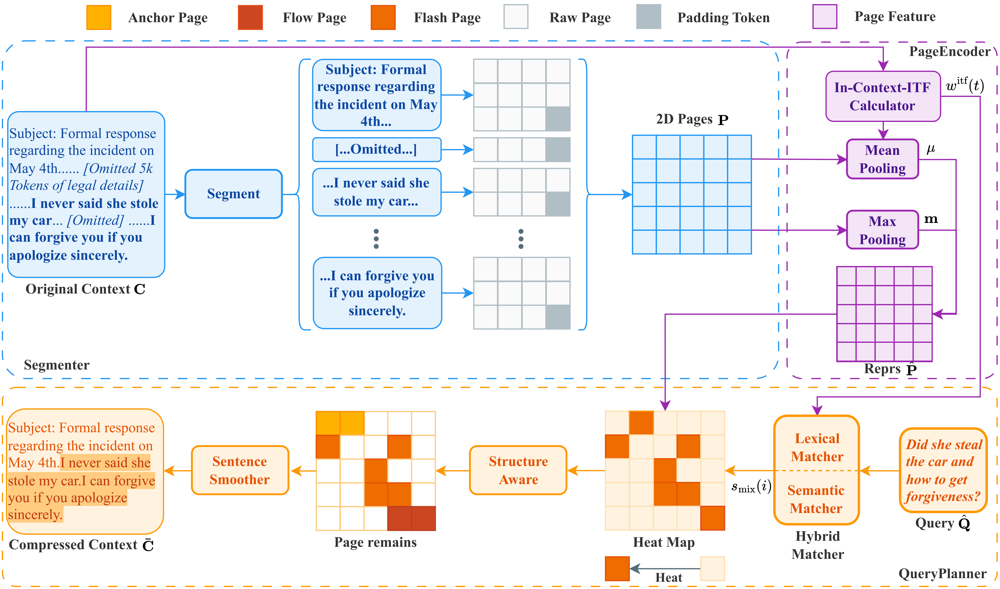
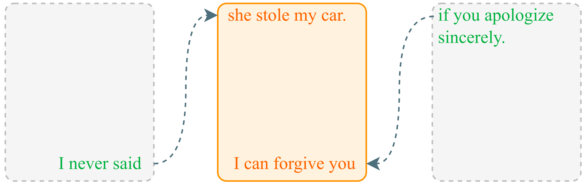
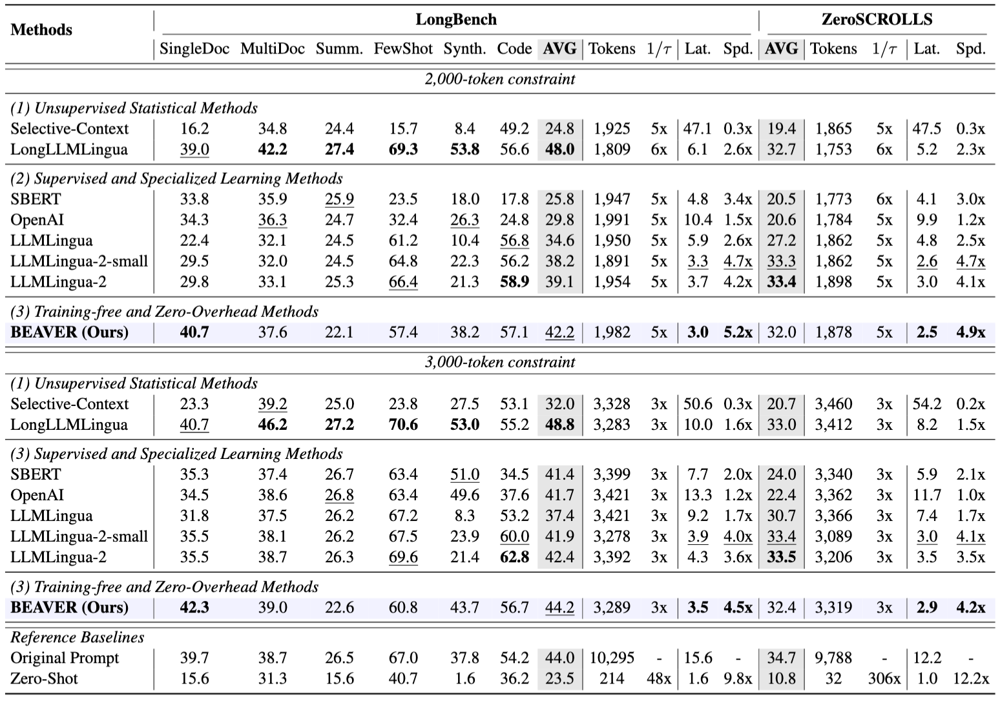
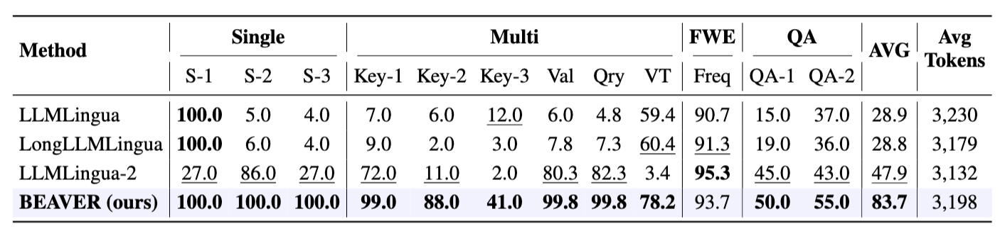
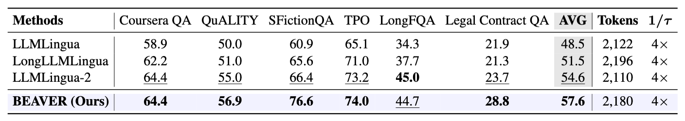
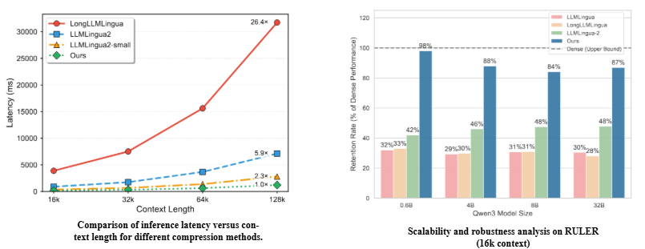
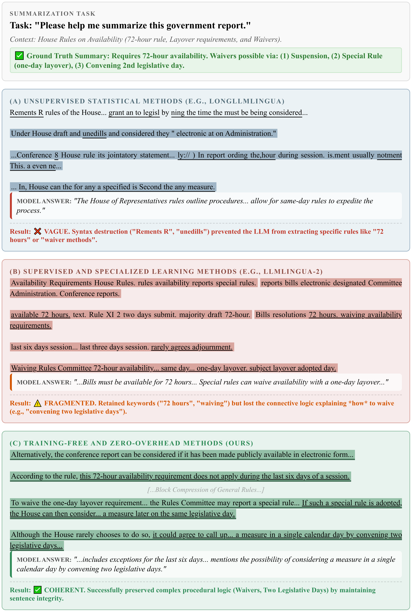

<p align="center">
  
</p>
<h3 align="center">BEAVER: Training-Free Hierarchical Prompt Compression via Structure-Aware Page Selection</h3>
<p align="center">
    <strong>Zhengpei Hu<sup>1*</sup>, Kai Li<sup>2*</sup>, Dapeng Fu<sup>3</sup>, Chang Zeng<sup>4</sup>, Yue Li<sup>1</sup>, Yuanhao Tang<sup>1</sup>, Jianqiang Huang<sup>1†</sup></strong><br>
  <sup>1</sup>Qinghai University &nbsp; <sup>2</sup>Tsinghua University &nbsp; <sup>3</sup>Ant Group SIL &nbsp; <sup>4</sup>National Institute of Informatics<br>
  <sub>* Equal contribution &nbsp; † Corresponding author</sub><br>
  <a href="#">📜 Paper</a> | <a href="https://cslikai.cn/BEAVER">🎬 Demo</a>
</p>
<p align="center">
  
  
  
</p>

> BEAVER is a training-free, structure-aware prompt compression framework that keeps discourse integrity while delivering extreme efficiency on long-context LLMs.

## 🔥 News
- **[2026/03]** Code and demo released!

## 🚀 Quick Start (demo script)
Run the end-to-end compression + report pipeline using the provided script:
```bash
bash demo-test.sh
```
or:
```bash
python Demo.py \
  --model_path Qwen/Qwen3-8B \
  --in_jsonl ./QA.jsonl \
  --out_json ./QA_Result.json \
  --dtype bf16 \
  --page_size 64 \
  --anchor_pages 1 \
  --flow_window 1 \
  --flash_top_k 1

python Build_Html.py
echo 'All done. Visualization file is QA_Report.html'
```
**Hyperparameters:**

| Parameter | Default | Description |
|---|---|---|
| `page_size` | 64 | Number of tokens per page tensor. Controls compression granularity (smaller = finer but slower). |
| `anchor_pages` | 1 | **Anchor prior.** Number of pages to force-keep at the beginning and end of the document, preserving key structural information (e.g., title, conclusion). |
| `flow_window` | 1 | **Flow prior.** Sliding window size around selected pages to maintain local discourse coherence. |
| `flash_top_k` | 1 | **Flash prior.** Number of additional top-scoring pages selected by hybrid semantic-lexical matching with the query. |

> The demo uses minimal values (all set to 1) for aggressive compression. The paper experiments use larger values (`anchor_pages=4, flow_window=4, flash_top_k=22`) for higher fidelity.

Outputs:
- `QA_Result.json`: compression statistics and model generations.
- `QA_Report.html`: visualized kept spans for each sample.

## 🧠 Method at a Glance

- **Comparison**: BEAVER targets structure-aware page selection instead of flat token pruning.

<p align="center">
  
</p>

- **Pipeline**: Segment text into page tensors, encode with dual-path pooling, plan queries with Anchor/Flow/Flash priors, then smooth to sentence boundaries.

<p align="center">
  
</p>

- **Sentence Smoother**: Restores syntactic coherence after selection.

<p align="center">
  
</p>

## 📊 Key Results

<p align="center">
  
</p>

<p align="center">
  
</p>

<p align="center">
  
</p>

<p align="center">
  
</p>

## 🎨 Task Visualizations

- **Few-shot reasoning**
<p align="center">
  
</p>

- **QA**
<p align="center">
  
</p>

- **Summarization**
<p align="center">
  
</p>

- **Code understanding**
<p align="center">
  
</p>

## 🧭 Overview
- **Segmenter**: maps variable-length text into 2D page tensors using natural delimiters, preserving local boundaries.
|- **PageEncoder**: training-free dual-path pooling merges global semantics with unsupervised In-Context ITF weighting.
- **QueryPlanner**: hybrid semantic–lexical scoring plus structural priors (Anchor, Flow, Flash) to pick valuable segments.
- **Sentence Smoother**: extends kept fragments to sentence boundaries to restore coherence after segmentation.

## 🔬 Experiment Details
- Benchmarks: LongBench, ZeroSCROLLS, RULER, L-Eval under 2k/3k token budgets.
- Backend LLM: gpt-3.5-turbo-instruct on NVIDIA A100.
- Baselines: LLMLingua series and embedding-based retrieval methods (see paper for hyperparameters).

## 🏆 Results
BEAVER surpasses SOTA baselines and dominates RULER multi-needle retrieval while delivering ~26× compression speedup on 128k contexts.